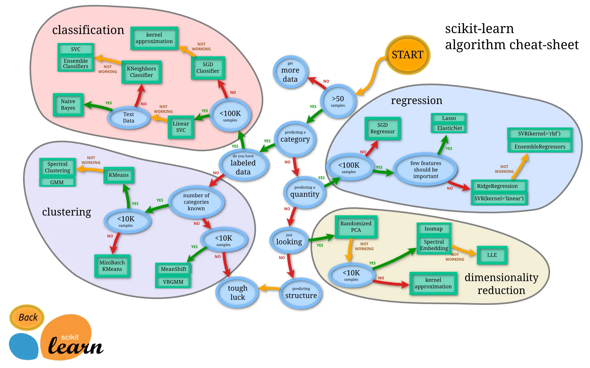
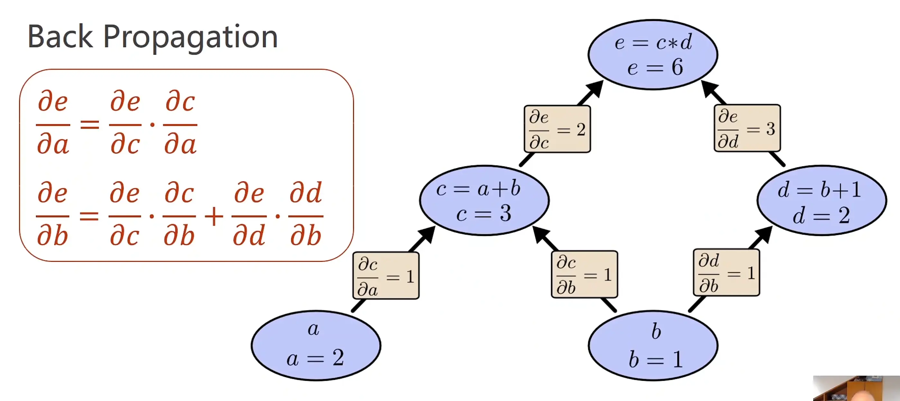

Human Intelligence: Information -> Infer / Image -> Prediction
Machine Learning: 监督学习
过去的算法：穷举、贪心、分治、动态规划——人工设计
机器学习：从Dataset里挖出算法（e.g.Logistic regression,Representation learning->Deep learning e.g.MLP)

#### History
**Rule-based systems**: Input -> Hand-designed program -> Output
	求原函数——构建原函数对应的知识库，定义变换规则（加减、三角变换）……
**Classic machine learning**: Input -> Hand-designed features -> Mapping from features(找到对应映射） -> Output
**Representation learning**:Input ->  features(通过学习提取） -> Mapping from features(找到对应映射） -> Output  //feature和mapping分开训练
维度诅咒：input feature 的维度越多，对样本数据的需求就越多 e.g. 1->10, 2->100, 3->1000……
	我们希望能将数据降维（映射到低维空间）且尽量保持高维空间的度量信息{representation}
	Manifold(流形）——处处可微的三维曲面可投射到二维
**Deep learning**:Input -> Simple features(e.g.将图片的像素值变成张量） ->Additional layers of more abstract features->  Mapping from features(找到对应映射） -> Output     
//end to end:feature和mapping一起用一个很大的模型训练

classic machine learnig:

#### Brief history of neural networks
猫猫实验：哺乳动物脑内的感知神经分层
神经元——感知机（Perceptron)
神经元连接——人工神经网络
**Back Propagation(反向传播）**：
	计算图——每一步进行原子运算
	正向计算（前馈过程，同时可求每步偏导）+反向传播（将单条路径上的偏导相乘，多条路径相加）
	
	LeNet-5, AlexNet, GoogLeNet & VGG, ResNet
Algorithm, Data, Computation